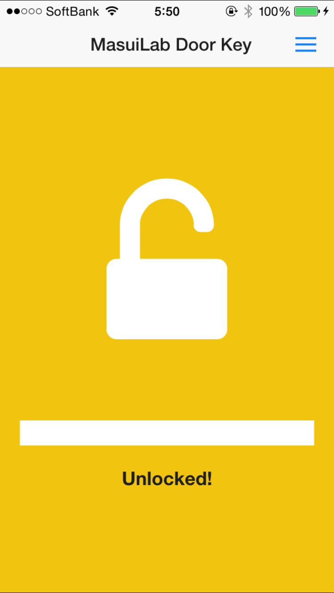

# MasuiLab DoorKey Unlock App for iOS/Android

by [@Hikaru_Itou](http://www.twitter.com/Hikaru_Itou)

* Powered by Apache Cordova
* Powered by Angular.js
* Powered by OnsenUI


## 1. Description

SFC増井研のデルタ館の扉の鍵を加速度センサーで開けるための単純なアプリ
iOS6以降、Androidはしらない
Cordova製、AccelerationUI


## 2. Screenshots and DemoVideo



[](http://www.youtube.com/watch?v=AHUTcSOyIbU)

冒頭のアニメーションは、本来アプリのスプラッシュ画面にしようと思って作ったSVGアニメーションですが、Androidで動作しないのを忘れてたため、アプリには組み込みませんでした。笑


## 3. Installation

基本的には普通のCordovaプロジェクトと同じ

### Install Cordova

```xml
$ sudo npm install -g cordova
```

### iOS

Open `platform/ios/DoorKey.xcodeproj`.

Setting your Provisioning Profile.

Build Projects for your Device.

### Android

```xml
$ cordova prepare
$ cordova run android
```

## 4. Usage

南京錠のアイコンをタップして、プログレスバーが表示されたら、端末を地面に対して水平に持って鍵を回すように、左に傾けるだけでロック解除できる。

